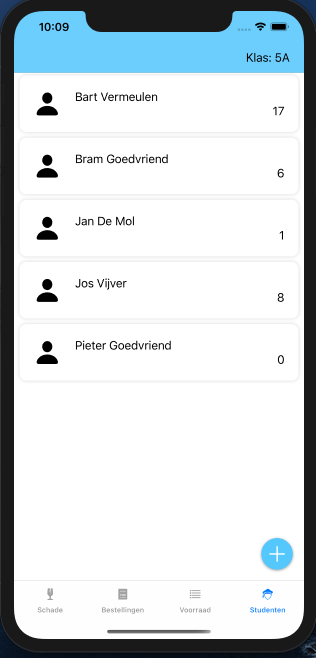

# Glaswerk IOS applicatie

Dit is mijn (**Bram Goedvriend**) IOS applicatie.

## Overview

Deze applicatie is geschreven voor een chemieleerkracht.  
In deze applicatie is het de bedoeling dat de chemieleerkracht de gebroken objecten uit het chemielokaal kan invoeren in de applicatie.  
Hierdoor kan de leerkracht bijhouden welke items gebroken zijn, door welke leerling en wanneer er nieuwe bestellingen moeten geplaatst worden.

## Getting started

Deze applicatie is gemaakt voor **IOS 13** en hoger.  
Het project kan gedownload worden via [deze link](https://github.com/Bramikke/Glaswerk-IOS/archive/master.zip).  
Open **Glaswerk.xcworkspace** om aan de slag te gaan.  
Uitvoeren kan door op de play knop te klikken.

> **Note:** Dit is een project in progress. Er kunnen nog enkele kleine bugs in zitten.  
Gelieve dit te melden.

## Screenshots

&nbsp;&nbsp;&nbsp;&nbsp;&nbsp;&nbsp;&nbsp;&nbsp; 

# Extra

Voor extra informatie ga naar: [www.bramgoedvriend.be](http://bramgoedvriend.be/).  
Ik ben te vinden op [Facebook](https://www.facebook.com/braampje.goedvriend) en [LinkedIn](https://www.linkedin.com/in/bramgoedvriend/).
